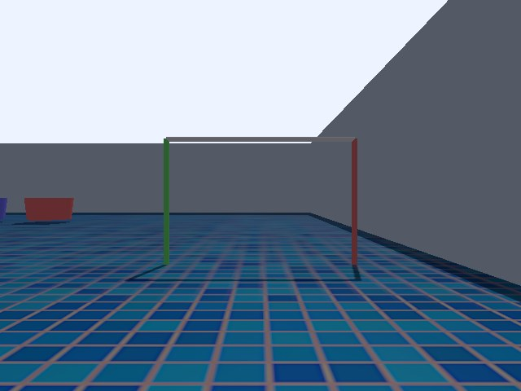
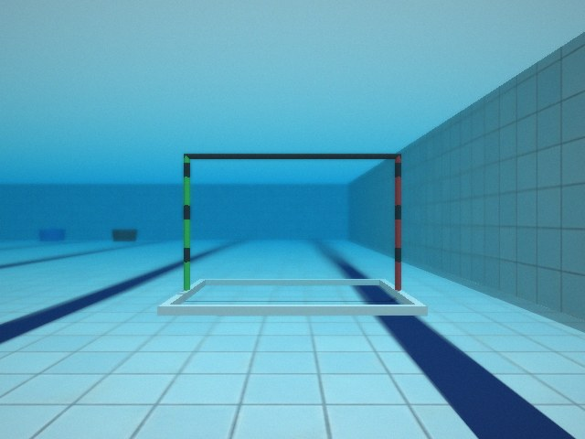
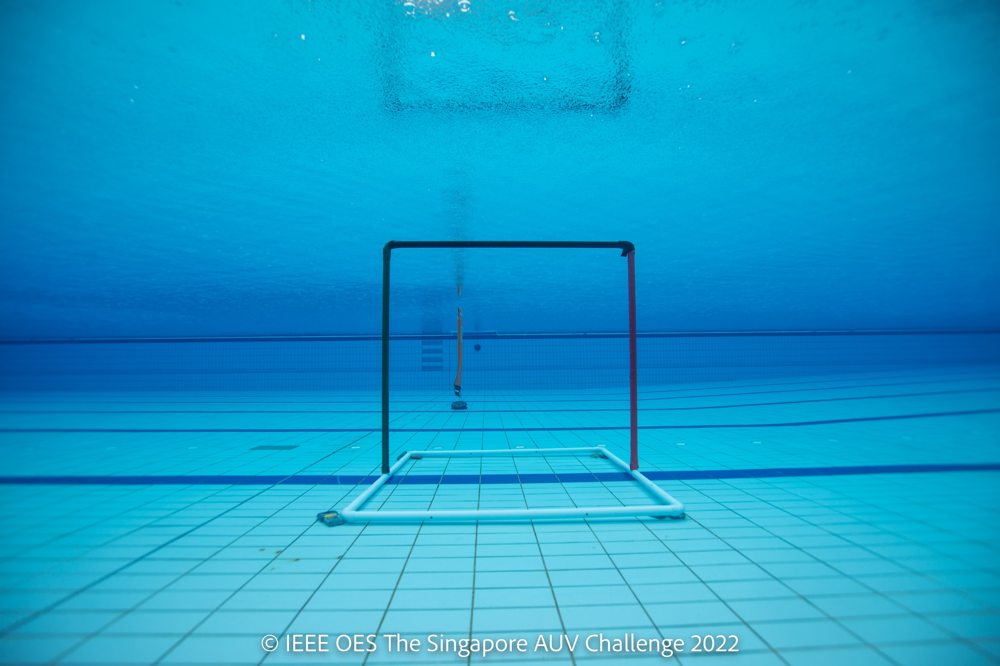
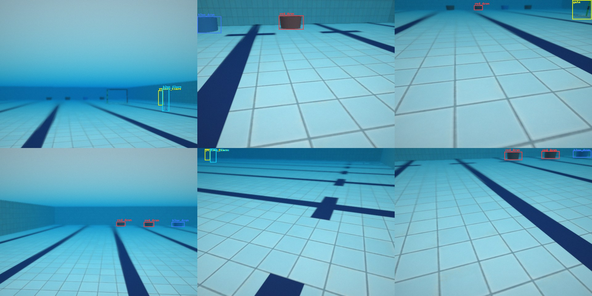

# 模擬場景視覺保真度改造

> 日期：2026-08-03
> 目標：讓 SAUVC-Simulation 的場景與道具貼近 SAUVC 2026 真實比賽，使 **SAUVC-JETSON 現有的 `finals.onnx`（以真實水下影像訓練）不必重訓就能在模擬中穩定辨識**
> 依據：[SAUVC 2026 rulebook v6.1.0](https://github.com/sauvc/rulebook) 原始碼與 `img/` 官方圖檔（副本見 [sim-visual/reference/](sim-visual/reference/)）

---

## 0. 結論先講

| 視角 | 目標類別 | 改造前 | 改造後 |
|---|---|---|---|
| 導航門 3 m | `gate` | **偵測不到** | **0.814** |
| 導航門 6 m | `gate` | 0.834 | 0.841 |
| 紅 flare 2 m | `red_flare` | 0.295（低於門檻） | **0.789** |
| 黃 flare 2 m | `yellow_flare` | **偵測不到** | **0.887** |
| 藍 flare 2 m | `blue_flare` | **偵測不到** | **0.900** |
| 目標桶 3 m | `red_drum` / `blue_drum` | 0.890 / 0.845 | 0.882 / 0.892 |
| 目標桶 1.6 m | `red_drum` / `blue_drum` | **紅桶偵測不到** / 0.756 | **0.836** / **0.911** |
| 橘 flare 3 m | `orange_flare` | **偵測不到** | 仍誤判為 `yellow_flare`（見 §5） |

`depth_perception` 的 `stability_conf_thresh` 是 0.35。改造前三個通訊 flare 全部低於此值，**Task 4 在模擬中根本不可能通過**；改造後三者都在 0.79 以上。

量測方式：同一組 9 個標準視角（相機光學與 AUV 的 RealSense 相同）、同一個 `seed=42` 場地佈局、同一個 `finals.onnx`，`conf=0.25 / NMS=0.45`。重現指令見 §6。

| | |
|---|---|
| 改造前 |  |
| 改造後 |  |
| 真實比賽（2022） |  |

---

## 1. 關鍵技術發現：Fortress 的 `<scene><fog>` 是 no-op

水下的距離衰減與朦朧**無法**靠改 world 檔達成。查證原始碼：

- `gz-rendering` 的 `ogre2/src/Ogre2Scene.cc` 全檔 **沒有任何 fog 相關實作**
- `gz-sim6` 的 `RenderUtil.cc` 只套用 `scene.Ambient()`、`scene.Background()`、grid 與 sky，**從未讀取 `scene.Fog()`**

也就是說在 Ignition Fortress + ogre2 底下，SDF 寫了 `<fog>` 會被**靜默忽略**。

因此水體改為在影像層處理。Gazebo 有給我們對齊的 depth buffer，有了 per-pixel 距離就能直接套用水下成像模型：

```
I_c = J_c · exp(−β_c · z)  +  B_c · (1 − exp(−β_c · z))
      ╰─ 直接穿透 ─╯          ╰──── 後向散射的 veiling light ────╯
```

實作在 [`bridge/underwater_camera_node.py`](../SAUVC-Simulation/sim_ws/src/bridge/bridge/underwater_camera_node.py)。

---

## 2. 官方規格 vs 改造前的落差

| 道具 | 2026 官方規格 | 改造前 | 影響 |
|---|---|---|---|
| `gate` | 150×100 cm，桿徑 4 cm，port 紅/黑相間、starboard 綠/黑相間；實照中橫桿為黑色且立於白色 PVC 方框底座 | 純紅柱＋純綠柱＋**白色**橫桿，無條紋、無底座 | 模型辨識 gate 最強的線索是「**深色矩形框輪廓**＋白色底座」。純色柱＋白橫桿把這個線索完全拿掉了 |
| `q_gate` | 150 cm 寬，桿徑 **4 cm**，橘色，白色浮條在水面 | 桿徑 **8 cm**（radius 0.04），柱長 2.2 m | 尺寸差 2 倍 |
| 通訊 flare ×3 | 80 cm 高、1.6 cm 直徑、**頂端一顆白色高爾夫球**、底部有底座 | 只有一根 1.6 cm 圓柱 | 1.6 cm 的柱子在 2 m 外只有 3–4 px 寬。**白球才是可偵測的主要特徵**，少了它等於不可見 |
| `orange_flare` | ~15 cm 寬，池底延伸到水面；實照是繫在黑色配重盤上的充氣式橘色扁平浮標 | 15 cm 直徑圓柱、長 2.2 m、直立無底座 | 形狀與高度都不對 |
| `red/blue_drum` | 60 cm 直徑 × 30 cm 深，位於池尾 ~2 m 的 target zone | `drum.obj` scale 0.4 → 實際 **89 cm × 44 cm**（大 48%）；放在 x=8.20，**距尾牆 4.3 m** | 尺寸與位置都錯 |
| 池深 | 兩端 1.2 m、中央 1.6 m 的 V 形斜底 | 平底 **2.2 m** | 讓載具能維持比賽池中不存在的深度 |
| 池底 | 淺藍磁磚 + 深藍水道線 + 端點 T 標記 | 馬賽克貼圖、無水道線 | 背景完全不像比賽泳池 |
| 水體 | — | **完全沒有**：無衰減、無色偏、無朦朧 | 最大的 domain gap |

`drum.obj` 的長寬比是 0.8897 : 0.4385 ≈ 2.03 : 1，官方是 60 : 30 = 2 : 1 —— 比例本來就對，只有 scale 錯。改成 **0.2698** 精準命中 59.99 cm × 29.58 cm。

---

## 3. 改了什麼

### 3.1 幾何與材質

- **池深 2.2 m → 1.6 m**（2026 側視圖的最深處）
- **池底貼圖**：`scripts/make_pool_textures.py` 把 AI 生成的無縫磁磚材質（`sim-visual/pool_tile_base.jpg`，25 cm 磁磚）鋪滿整池，再以**精確公制位置**疊上 8 條深藍水道線與端點 T 標記。Gazebo 的 `<plane>` UV 是 0..1 對應整個平面，所以貼圖是整池一次烘焙 —— 這正是水道線能落在正確位置的原因
- **池壁**：同一磁磚材質 + 烘焙的排水溝與水線帶；另加兩盞低角度補光（單一頂光會讓垂直池壁近乎全黑，與實照不符）
- **水面**：z=0 的可見平面。所有實照裡都有這片明亮的「天花板」；沒有它畫面會像乾的房間。用 box 而非 plane —— Gazebo 的 plane 是單面的，從下往上看不見。
  它是不透明的，所以在 GUI 裡從上方會蓋住整個池子；要檢視場地佈局時把 `water_surface` 這個 model 暫時關掉即可（實測改成半透明對水下偵測分數沒有影響：gate 0.814 → 0.817，若之後想常駐是可行的）
- **gate**：紅/黑、綠/黑相間條紋（20 cm 彩 + 10 cm 黑）、黑色橫桿、白色 PVC 方框底座
- **q_gate**：桿徑修正為 4 cm、長度依水深、白色浮條
- **通訊 flare ×3**：加上頂端白色高爾夫球（4.3 cm）與底座
- **orange_flare**：改為 15 cm 寬扁平浮標 + 黑色配重盤
- **drum**：scale 0.4 → 0.2698，並補上 4.33 cm 的 mesh 基準偏移讓它確實貼地
- **新增 `red_tub` / `blue_tub`**：60×40×30 cm 開口方形塑膠箱。rulebook 文字寫「60 cm 直徑」，但它用來說明的照片（`drums-2017.jpg`）是方形塑膠箱，公開訓練資料集也一律標成 "pail"/"tub"。主辦單位兩種都用過，所以兩種都做，由 `DRUM_STYLE` 選擇

### 3.2 水下成像（`underwater_camera_node`）

橋接改為：Gazebo 原始畫面 → `color/image_raw_dry` → 本節點 → `color/image_raw`。**感知堆疊訂閱的 topic 與實機完全相同，永遠看不到乾的畫面。**

模型除了物理衰減與散射，還重現相機本身的行為：距離相關的散射模糊、RealSense 的自動白平衡、自動曝光、感測器雜訊與輕微暗角。

參數不是教科書值，是**用官方實照反推的**。在 `arena-2017.jpg` 上取樣池底，近處 RGB (115, 209, 241)、約 10 m 外 (14, 153, 222)，代入模型解出 β 與 veiling light：

| | 近池底 | 中池底 | 遠池底 |
|---|---|---|---|
| 真實 `arena-2017.jpg` | (115, 209, 241) | (95, 197, 240) | (14, 153, 222) |
| 模擬（改造後） | (139, 206, 224) | (58, 167, 204) | (24, 142, 194) |

兩個容易踩的點：

- **自動白平衡不能開太強。** 真實影像其實保留了大量藍色偏；grey-world 校正開到 0.65 會把近景拉成粉灰色，反而把模型用來區分紅藍道具的顏色線索抹掉。定在 0.15
- **無幾何的像素要推到「無限遠」。** 深度緩衝在這些像素回傳 0/NaN/inf，把它們當成「貼在鏡頭上」畫面就毀了；推到 60 m 之外才會完全收斂到 veiling 色，天空背景才會變成開闊水體

### 3.3 域隨機化

| 參數 | 位置 | 說明 |
|---|---|---|
| `DRUM_STYLE=drum\|tub\|random` | `make sim` | 目標容器形狀 |
| `RANDOMIZE_WATER=true` | `make sim` | 每 20 秒重抽一次水質、能見度與曝光 |
| `SEED=<int>` | `make sim` | 固定佈局以便重現 |

道具位置本來就每次隨機（gate 沿 16 m 線、橘 flare 在 4–8 m 區、通訊 flare 在 8–16 m 區、桶序與間距），與真實比賽一致。

---

## 4. 工具

| 工具 | 用途 |
|---|---|
| [`scripts/capture_view.py`](../SAUVC-Simulation/sim_ws/src/bringup/scripts/capture_view.py) | 從任意視角截圖；`--arena-views` 依各道具實際位置自動產生標準視角。截圖會走與模擬完全相同的 `WaterColumn`，所以看到的就是感知端收到的畫面（`--dry` 可看底下的乾畫面） |
| [`scripts/generate_dataset.py`](../SAUVC-Simulation/sim_ws/src/bringup/scripts/generate_dataset.py) | 自動標註資料集產生器。相機沿合理任務路徑隨機取樣，bbox 由 Gazebo 的道具位姿解析投影而得 |
| [`scripts/make_pool_textures.py`](../SAUVC-Simulation/sim_ws/src/bringup/scripts/make_pool_textures.py) | 重新烘焙池底/池壁貼圖 |

### 自動標註的兩個誠實性條件

標註正確不等於標註誠實。兩個過濾條件是實作過程中被實測逼出來的：

1. **近平面裁切。** 直接丟掉在相機後方的角點，會把「相機正貼著道具」的畫面整張漏標 —— 而那正是偵測器最需要的近距離樣本。改成對 AABB 的 12 條邊逐一做近平面裁切
2. **量測實際對比度，而不是只看衰減。** 綠光幾乎不衰減，但 15 m 外的道具早已被 veiling light 淹沒。改成直接量測框內與框外環帶的像素差 —— 把標註綁在相機真正解析得出來的東西上



---

## 5. 已知限制

- **`orange_flare` 在 3 m 距離會被判成 `yellow_flare`**（0.59）。1.2 m 時才正確觸發 `orange_flare`（0.52）。
  這**不是模擬的問題**：把 `finals.onnx` 直接跑在官方實照上，`orange-flare-2022.jpg`（真實橘色浮標）同樣被判成 `red_flare`（0.45）。模型本身對這個類別就不穩。橘色材質已依實照校正到 R>G>B 的正確色序（模擬 (106, 90, 52) vs 實照 (135, 90, 79)），再往下調就變成在遷就模型的缺陷而非還原場地
- **池底是 1.6 m 平底，不是官方的 V 形斜底**（兩端 1.2 m）。這是刻意的取捨：斜底會讓現有的深度 PID 調參、BT 深度目標與 altimeter 零點全部需要重新驗證
- **`WaterColumn` 的散射模糊是全域模糊按距離混合**，不是逐像素變化的核。30 Hz 下這個近似划算，但景深邊界處會略有不準
- **`generate_dataset.py` 的 `PROP_EXTENTS` 是手動維護的**，改道具幾何時要同步更新
- **遠處目標桶仍會被偵測到**（0.26–0.45）。真實比賽中 15 m 外的桶應該完全看不見。目前的 veiling 強度還不足以完全吃掉它們

---

## 6. 重現

```bash
# 場景（headless、固定佈局）
make sim ARENA=finals SEED=42 HEADLESS=true DRUM_STYLE=drum

# 標準視角截圖（走水下成像，等同感知端收到的畫面）
docker compose exec sim bash -lc '
  source /root/sim_ws/install/setup.bash &&
  ros2 run bringup capture_view.py --arena-views --out /root/captures --prefix after_'

# 產生標註資料集
docker compose exec sim bash -lc '
  source /root/sim_ws/install/setup.bash &&
  PYTHONPATH=/root/sim_ws/install/bringup/lib/bringup:$PYTHONPATH \
  ros2 run bringup generate_dataset.py --out /root/dataset --count 500 --randomize-water'

# 離線量測（在有 onnxruntime 的環境）
python3 yolo_probe.py SAUVC-JETSON/model/finals.onnx 'captures/after_*.png'
```

`make sim` 的可用參數：`ARENA=finals|qualification`、`SEED=<int>`、`HEADLESS=true`、
`DRUM_STYLE=drum|tub|random`、`RANDOMIZE_WATER=true`、`SOFTGL=1`。

---

## 7. 附錄：踩到的坑

- **執行期移除 RGB-D sensor 會讓 Gazebo 整個掛掉。** `Ogre2DepthCamera::Render()` 內的 assertion（`This Datablock is still being used by some Renderables`）。表面症狀只是「感測器 topic 沒資料」。`capture_view.py` 因此只在相機不存在時建立，之後一律只移動
- **移動相機後要等算繪跟上。** Gazebo 的 sensor 算繪落後 pose 設定一到兩幀。取到舊幀卻配上新姿態的幾何，就會得到「框浮在空水裡」的標註 —— 這個 bug 一度讓整份資料集看起來像是投影數學寫錯了（投影其實是對的）
- **`colcon build --symlink-install` 不會幫你補執行權限。** `install(PROGRAMS ...)` 對 symlink 無效，來源檔沒有 +x 就是 `No executable found`
